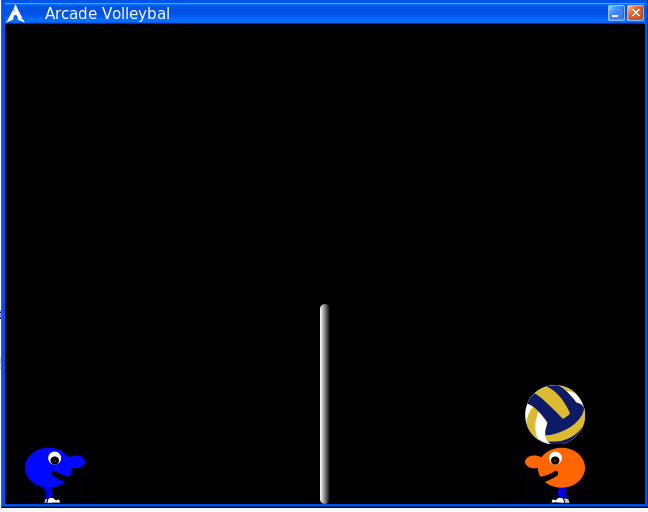

# Arcade Volleyball
remake of Arcade Volleyball, 1989 [DOS game by Rhett Anderson](https://en.wikipedia.org/wiki/Arcade_Volleyball), writen in pure C and SDL2.



## About
Trying to teach myself programming, I found C the easiest to grasp because it exposes the inner working of computer. I was surprissed there are only few resources about game programing in pure C.

Hopefuly, this repo can be useful for some other absolute beginers in programing like me.

## Requirements

- [SDL 2.0](https://www.libsdl.org/download-2.0.php)

## Compiling

To compile on Windows you need [mingw-w64](http://mingw-w64.org/doku.php/download)

```bash
$ cd to/directory/Arcade_Volleyball
$ make
```

## Further reading

Most undertandable course I found is VertoSudios' [Learn Video Game Programming in C](https://youtu.be/JPAyj85tJ5E)
